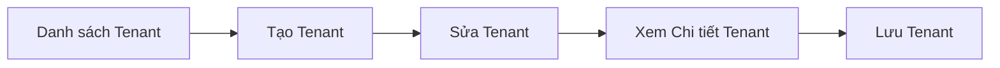
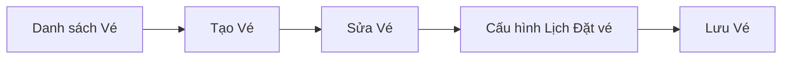
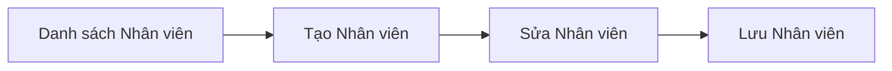
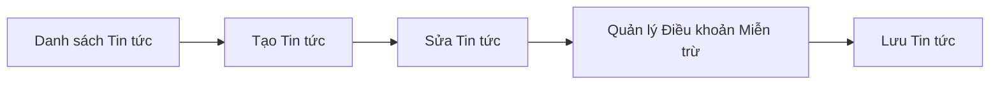
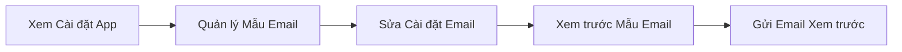

# Quản lý Cơ sở & Nội dung (Admin)

Quản trị back-office cho đơn vị vận hành cơ sở: quản lý tenant (cơ sở), vé/gói vé, tài khoản nhân viên, thông báo tin tức, điều khoản miễn trừ, và cài đặt app/email qua bảng điều khiển admin.

**Độ phức tạp:** `phức tạp` · **Tags:** `admin`, `management`, `dashboard`, `configuration`

## Entities chính

- `Tenant`
- `Ticket`
- `TicketBookingSchedule`
- `Staff`
- `News`
- `Disclaimer`
- `AppSetting`
- `EmailSetting`

## Business Rules

- Chỉ tài khoản admin/nhân viên đã xác thực mới truy cập được các màn hình quản lý
- Tenant phải được cấu hình trước khi có thể tạo vé gắn với tenant đó
- Lịch đặt vé (booking schedule) xác định thời điểm vé có thể được đặt

## Tương tác với domain khác

- Cấu hình GMO được domain Thanh toán & Hóa đơn sử dụng
- Cấu hình dữ liệu vé/tenant được domain Check-in POS & Quét vé sử dụng
- Quản lý tài khoản nhân viên song song với domain Tài khoản Người dùng & Xác thực

## Tính năng (5)

### Quản lý Tenant (Cơ sở)

Admin tạo, xem, sửa và liệt kê các tenant (cơ sở) chứa vé có thể đặt.

**Bắt đầu từ:** 🌐 HTTP · **Độ phức tạp:** `trung bình`

**Các bước:**

1. **Danh sách Tenant** — Admin xem danh sách tenant đã đăng ký.
2. **Tạo Tenant** — Admin tạo bản ghi tenant cơ sở mới.
3. **Sửa Tenant** — Admin sửa cấu hình tenant hiện có.
4. **Xem Chi tiết Tenant** — Admin xem đầy đủ chi tiết của một tenant cụ thể.
5. **Lưu Tenant** — Dữ liệu tenant được lưu qua API admin tenants.

Chi tiết kỹ thuật — file liên quan trong code (dành cho Dev/Techlead)

Endpoint/trigger: `GET /admin/tenant-management`

| # | Bước | File |
|---|---|---|
| 1 | Danh sách Tenant | `src/pages/admin/tenant-management/index.tsx` |
| 2 | Tạo Tenant | `src/pages/admin/tenant-management/create.tsx` |
| 3 | Sửa Tenant | `src/pages/admin/tenant-management/edit/[tenantCode].tsx` |
| 4 | Xem Chi tiết Tenant | `src/pages/admin/tenant-management/view/[tenantCode].tsx` |
| 5 | Lưu Tenant | `src/pages/api/admin/tenants/index.ts` |

### Quản lý Vé (Gói vé)

Admin quản lý các gói vé có thể đặt theo từng tenant, bao gồm cài đặt giá/giảm giá và lịch đặt vé.

**Bắt đầu từ:** 🌐 HTTP · **Độ phức tạp:** `trung bình`

**Các bước:**

1. **Danh sách Vé** — Admin xem danh sách gói vé.
2. **Tạo Vé** — Admin tạo gói vé mới.
3. **Sửa Vé** — Admin sửa cấu hình gói vé hiện có.
4. **Cấu hình Lịch Đặt vé** — Admin cấu hình khung thời gian lịch đặt vé cho gói vé.
5. **Lưu Vé** — Dữ liệu gói vé được lưu qua API admin tickets.

Chi tiết kỹ thuật — file liên quan trong code (dành cho Dev/Techlead)

Endpoint/trigger: `GET /admin/ticket-management`

| # | Bước | File |
|---|---|---|
| 1 | Danh sách Vé | `src/pages/admin/ticket-management/index.tsx` |
| 2 | Tạo Vé | `src/pages/admin/ticket-management/create.tsx` |
| 3 | Sửa Vé | `src/pages/admin/ticket-management/edit/[ticketId].tsx` |
| 4 | Cấu hình Lịch Đặt vé | `src/pages/api/admin/ticket-booking-schedules/index.ts` |
| 5 | Lưu Vé | `src/pages/api/admin/tickets/index.ts` |

### Quản lý Tài khoản Nhân viên

Admin quản lý tài khoản nhân viên vận hành bảng điều khiển admin và công cụ quét POS.

**Bắt đầu từ:** 🌐 HTTP · **Độ phức tạp:** `đơn giản`

**Các bước:**

1. **Danh sách Nhân viên** — Admin xem danh sách tài khoản nhân viên.
2. **Tạo Nhân viên** — Admin tạo tài khoản nhân viên mới.
3. **Sửa Nhân viên** — Admin sửa tài khoản nhân viên hiện có.
4. **Lưu Nhân viên** — Dữ liệu tài khoản nhân viên được lưu qua API admin staffs.

Chi tiết kỹ thuật — file liên quan trong code (dành cho Dev/Techlead)

Endpoint/trigger: `GET /admin/staff-management`

| # | Bước | File |
|---|---|---|
| 1 | Danh sách Nhân viên | `src/pages/admin/staff-management/index.tsx` |
| 2 | Tạo Nhân viên | `src/pages/admin/staff-management/create.tsx` |
| 3 | Sửa Nhân viên | `src/pages/admin/staff-management/edit/[id].tsx` |
| 4 | Lưu Nhân viên | `src/pages/api/admin/staffs/index.ts` |

### Quản lý Tin tức & Điều khoản Miễn trừ

Admin đăng thông báo tin tức hiển thị cho người dùng và quản lý điều khoản miễn trừ trách nhiệm pháp lý hiển thị trong quá trình đặt vé.

**Bắt đầu từ:** 🌐 HTTP · **Độ phức tạp:** `đơn giản`

**Các bước:**

1. **Danh sách Tin tức** — Admin xem danh sách tin tức đã đăng.
2. **Tạo Tin tức** — Admin tạo thông báo tin tức mới.
3. **Sửa Tin tức** — Admin sửa thông báo tin tức hiện có.
4. **Quản lý Điều khoản Miễn trừ** — Admin quản lý nội dung điều khoản miễn trừ hiển thị trong luồng đặt vé.
5. **Lưu Tin tức** — Nội dung tin tức được lưu qua API admin news.

Chi tiết kỹ thuật — file liên quan trong code (dành cho Dev/Techlead)

Endpoint/trigger: `GET /admin/news-management`

| # | Bước | File |
|---|---|---|
| 1 | Danh sách Tin tức | `src/pages/admin/news-management/index.tsx` |
| 2 | Tạo Tin tức | `src/pages/admin/news-management/create.tsx` |
| 3 | Sửa Tin tức | `src/pages/admin/news-management/edit/[newsId].tsx` |
| 4 | Quản lý Điều khoản Miễn trừ | `src/pages/admin/disclaimer-management.tsx` |
| 5 | Lưu Tin tức | `src/pages/api/admin/news/index.ts` |

### Quản lý Cài đặt App & Email

Admin cấu hình cài đặt ứng dụng toàn cục và tùy chỉnh/kiểm thử mẫu email giao dịch.

**Bắt đầu từ:** 🌐 HTTP · **Độ phức tạp:** `trung bình`

**Các bước:**

1. **Xem Cài đặt App** — Admin xem và chỉnh sửa cài đặt ứng dụng toàn cục.
2. **Quản lý Mẫu Email** — Admin xem danh sách mẫu email có thể cấu hình.
3. **Sửa Cài đặt Email** — Admin sửa nội dung của một mẫu email cụ thể.
4. **Xem trước Mẫu Email** — Admin xem trước cách mẫu email đã sửa sẽ hiển thị.
5. **Gửi Email Xem trước** — Admin gửi email thử/xem trước để kiểm tra kết quả mẫu email.

Chi tiết kỹ thuật — file liên quan trong code (dành cho Dev/Techlead)

Endpoint/trigger: `GET /admin/app-settings`

| # | Bước | File |
|---|---|---|
| 1 | Xem Cài đặt App | `src/pages/admin/app-settings.tsx` |
| 2 | Quản lý Mẫu Email | `src/pages/admin/email-settings/index.tsx` |
| 3 | Sửa Cài đặt Email | `src/pages/admin/email-settings/edit/[emailKey].tsx` |
| 4 | Xem trước Mẫu Email | `src/pages/api/admin/email-settings/preview.ts` |
| 5 | Gửi Email Xem trước | `src/pages/api/admin/email-settings/send-preview-email.ts` |

