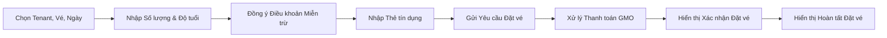
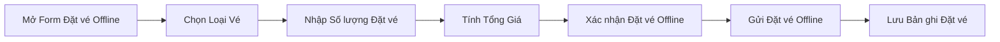
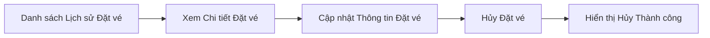
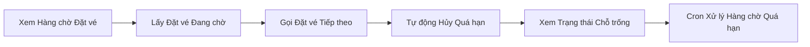
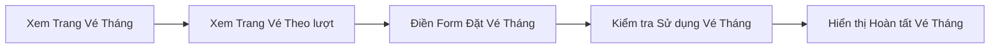

# Quản lý Đặt vé & Đặt chỗ

Xử lý toàn bộ vòng đời đặt chỗ tại cơ sở: tạo đặt vé online và offline, mua vé tháng/vé theo lượt, quản lý lịch sử đặt vé, hủy vé, và theo dõi hàng chờ/chỗ trống. Đây là domain nghiệp vụ cốt lõi của ứng dụng, xoay quanh tenant, vé và người dùng.

**Độ phức tạp:** `phức tạp` · **Tags:** `booking`, `reservation`, `core-domain`, `ticket`

## Entities chính

- `Booking`
- `Ticket`
- `TicketBookingSchedule`
- `BookingQueue`
- `MasterMonthlyTicket`
- `Tenant`
- `User`

## Business Rules

- Một đặt vé phải tham chiếu đến vé và tenant hợp lệ còn chỗ trống
- Vé tháng và vé theo lượt không được đặt/sử dụng trùng giữa các tenant vượt quá giới hạn cho phép
- Đặt vé bị hủy hoặc hết hạn sẽ giải phóng chỗ trống và kích hoạt các cron job nhắc nhở

## Tương tác với domain khác

- Yêu cầu phiên đăng nhập người dùng đã xác thực
- Kích hoạt xác thực thanh toán GMO
- Check-in/check-out đặt vé được thực hiện qua quét mã POS/Smaregi

## Tính năng (5)

### Tạo đặt vé trực tuyến

Người dùng chọn tenant, vé và ngày, nhập số lượng/độ tuổi, đồng ý điều khoản miễn trừ trách nhiệm, thanh toán qua GMO/thẻ tín dụng, và nhận xác nhận đặt vé.

**Bắt đầu từ:** 🌐 HTTP · **Độ phức tạp:** `phức tạp`

**Các bước:**

1. **Chọn Tenant, Vé, Ngày** — Người dùng chọn tenant, loại vé và ngày đặt trong form đặt vé online.
2. **Nhập Số lượng & Độ tuổi** — Người dùng nhập số lượng người lớn/trẻ em và độ tuổi cho đặt vé.
3. **Đồng ý Điều khoản Miễn trừ** — Người dùng xem và đồng ý điều khoản miễn trừ trách nhiệm của cơ sở trước khi đặt vé.
4. **Nhập Thẻ tín dụng** — Người dùng nhập hoặc chọn thẻ tín dụng đã lưu để thanh toán online.
5. **Gửi Yêu cầu Đặt vé** — Yêu cầu đặt vé được gửi đến API bookings của user để tạo mới.
6. **Xử lý Thanh toán GMO** — Cổng thanh toán GMO xác thực và ghi nhận thanh toán online cho đặt vé.
7. **Hiển thị Xác nhận Đặt vé** — Hệ thống hiển thị màn hình xác nhận tóm tắt đặt vé đã hoàn tất.
8. **Hiển thị Hoàn tất Đặt vé** — Trang hoàn tất đặt vé được hiển thị, kết thúc luồng đặt vé online.

Chi tiết kỹ thuật — file liên quan trong code (dành cho Dev/Techlead)

Endpoint/trigger: `GET /booking/payment-online (PaymentOnlineBookingForm)`

| # | Bước | File |
|---|---|---|
| 1 | Chọn Tenant, Vé, Ngày | `src/components/CreateBooking/PaymentOnlineBookingForm/index.tsx` |
| 2 | Nhập Số lượng & Độ tuổi | `src/components/CreateBooking/QuantityAndAgesInfoFields/index.tsx` |
| 3 | Đồng ý Điều khoản Miễn trừ | `src/components/CreateBooking/DisclaimerTermsCheckbox/index.tsx` |
| 4 | Nhập Thẻ tín dụng | `src/components/CreateBooking/CreditCardForm/index.tsx` |
| 5 | Gửi Yêu cầu Đặt vé | `src/pages/api/user/bookings/index.ts` |
| 6 | Xử lý Thanh toán GMO | `src/services/gmo.service.ts` |
| 7 | Hiển thị Xác nhận Đặt vé | `src/components/CreateBooking/BookingConfirmation/index.tsx` |
| 8 | Hiển thị Hoàn tất Đặt vé | `src/components/CreateBooking/BookingCompletion/index.tsx` |

### Tạo đặt vé Offline/Admin

Admin hoặc nhân viên cơ sở tạo đặt vé thay cho khách vãng lai, chọn loại vé, tính giá, và xác nhận thanh toán offline.

**Bắt đầu từ:** 🖐️ Thao tác thủ công · **Độ phức tạp:** `trung bình`

**Các bước:**

1. **Mở Form Đặt vé Offline** — Nhân viên mở form đặt vé offline để bắt đầu đặt vé cho khách vãng lai.
2. **Chọn Loại Vé** — Nhân viên chọn loại vé như vé tháng hoặc vé theo lượt.
3. **Nhập Số lượng Đặt vé** — Nhân viên nhập số lượng người lớn/trẻ em và độ tuổi cho đặt vé vãng lai.
4. **Tính Tổng Giá** — Hệ thống tính tổng giá đặt vé bao gồm giảm giá cho đặt vé offline.
5. **Xác nhận Đặt vé Offline** — Nhân viên xem lại và xác nhận thông tin đặt vé offline trước khi gửi.
6. **Gửi Đặt vé Offline** — Đặt vé offline được gửi và lưu qua API bookings của admin.
7. **Lưu Bản ghi Đặt vé** — Bản ghi đặt vé được lưu cùng các trường tính toán qua các utility booking phía server.

Chi tiết kỹ thuật — file liên quan trong code (dành cho Dev/Techlead)

Endpoint/trigger: `Admin/staff offline booking form (PaymentOfflineBookingForm)`

| # | Bước | File |
|---|---|---|
| 1 | Mở Form Đặt vé Offline | `src/components/CreateBooking/PaymentOfflineBookingForm/index.tsx` |
| 2 | Chọn Loại Vé | `src/components/CreateBooking/PaymentOfflineBookingForm/UserMonthlyBookingForm.tsx` |
| 3 | Nhập Số lượng Đặt vé | `src/components/CreateBooking/PaymentOfflineBookingForm/BookingForm.tsx` |
| 4 | Tính Tổng Giá | `src/components/CreateBooking/PaymentOfflineBookingForm/TotalBookingInfo.tsx` |
| 5 | Xác nhận Đặt vé Offline | `src/components/CreateBooking/PaymentOfflineBookingForm/PaymentOfflineBookingConfirmation.tsx` |
| 6 | Gửi Đặt vé Offline | `src/pages/api/admin/bookings/index.ts` |
| 7 | Lưu Bản ghi Đặt vé | `src/utils/server/booking.ts` |

### Quản lý Lịch sử Đặt vé

Người dùng xem các đặt vé trong quá khứ và sắp tới, xem chi tiết, cập nhật thông tin đặt vé, hoặc hủy đặt vé hiện có.

**Bắt đầu từ:** 🌐 HTTP · **Độ phức tạp:** `trung bình`

**Các bước:**

1. **Danh sách Lịch sử Đặt vé** — Người dùng xem danh sách lịch sử đặt vé có phân trang.
2. **Xem Chi tiết Đặt vé** — Người dùng xem đầy đủ chi tiết của một đặt vé cụ thể theo ID.
3. **Cập nhật Thông tin Đặt vé** — Người dùng cập nhật thông tin có thể chỉnh sửa trên đặt vé hiện có.
4. **Hủy Đặt vé** — Người dùng hủy đặt vé qua API cancel bookings.
5. **Hiển thị Hủy Thành công** — Hệ thống xác nhận với người dùng việc hủy đặt vé thành công.

Chi tiết kỹ thuật — file liên quan trong code (dành cho Dev/Techlead)

Endpoint/trigger: `GET /user/my-page/booking-history`

| # | Bước | File |
|---|---|---|
| 1 | Danh sách Lịch sử Đặt vé | `src/pages/user/my-page/booking-history/index.tsx` |
| 2 | Xem Chi tiết Đặt vé | `src/pages/user/my-page/booking-history/[id].tsx` |
| 3 | Cập nhật Thông tin Đặt vé | `src/pages/user/my-page/booking-history/update/[id].tsx` |
| 4 | Hủy Đặt vé | `src/pages/api/user/bookings/cancel.ts` |
| 5 | Hiển thị Hủy Thành công | `src/pages/user/my-page/booking-history/cancel-success.tsx` |

### Hàng chờ Đặt vé & Theo dõi Chỗ trống

Admin theo dõi và quản lý hàng chờ đặt vé theo thời gian thực (đang chờ/đang gọi/đã hủy) và trạng thái chỗ trống của cơ sở, với cron job tự động hết hạn các mục hàng chờ quá hạn.

**Bắt đầu từ:** 🌐 HTTP · **Độ phức tạp:** `trung bình`

**Các bước:**

1. **Xem Hàng chờ Đặt vé** — Admin xem dashboard hàng chờ đặt vé hiện tại.
2. **Lấy Đặt vé Đang chờ** — Hệ thống lấy các đặt vé đang ở trạng thái chờ trong hàng chờ.
3. **Gọi Đặt vé Tiếp theo** — Admin gọi đặt vé tiếp theo trong hàng chờ để tiến hành check-in.
4. **Tự động Hủy Quá hạn** — Hệ thống tự động hủy các đặt vé ở quá lâu trong hàng chờ mà không phản hồi.
5. **Xem Trạng thái Chỗ trống** — Admin xem trạng thái chỗ trống hiện tại của cơ sở, tính từ các đặt vé đang hoạt động.
6. **Cron Xử lý Hàng chờ Quá hạn** — Cron job theo lịch xử lý và làm hết hạn các đặt vé ở trạng thái đang gọi quá hạn.

Chi tiết kỹ thuật — file liên quan trong code (dành cho Dev/Techlead)

Endpoint/trigger: `GET /admin/booking-queue`

| # | Bước | File |
|---|---|---|
| 1 | Xem Hàng chờ Đặt vé | `src/pages/admin/booking-queue/index.tsx` |
| 2 | Lấy Đặt vé Đang chờ | `src/pages/api/admin/booking-queue/waiting.ts` |
| 3 | Gọi Đặt vé Tiếp theo | `src/pages/api/admin/booking-queue/calling.ts` |
| 4 | Tự động Hủy Quá hạn | `src/pages/api/admin/booking-queue/system-cancelled.ts` |
| 5 | Xem Trạng thái Chỗ trống | `src/pages/admin/booking-vacancies/index.tsx` |
| 6 | Cron Xử lý Hàng chờ Quá hạn | `src/pages/api/cron-job/process-overdue-calling-booking.ts` |

### Mua Vé Tháng/Vé Theo lượt

Người dùng xem và mua các gói vé định kỳ (vé tháng hoặc vé theo lượt) cho phép đặt vé nhiều lần trong tương lai theo giới hạn sử dụng.

**Bắt đầu từ:** 🌐 HTTP · **Độ phức tạp:** `trung bình`

**Các bước:**

1. **Xem Trang Vé Tháng** — Người dùng xem trang giới thiệu mua vé tháng.
2. **Xem Trang Vé Theo lượt** — Người dùng xem trang giới thiệu mua vé theo lượt.
3. **Điền Form Đặt Vé Tháng** — Người dùng điền form đặt vé tháng để cấu hình mua gói vé.
4. **Kiểm tra Sử dụng Vé Tháng** — Hệ thống kiểm tra vé tháng đã được sử dụng ở tenant khác chưa trước khi cho phép mua.
5. **Hiển thị Hoàn tất Vé Tháng** — Hệ thống hiển thị xác nhận hoàn tất đặt vé tháng.

Chi tiết kỹ thuật — file liên quan trong code (dành cho Dev/Techlead)

Endpoint/trigger: `GET /booking/buy-monthly-ticket`

| # | Bước | File |
|---|---|---|
| 1 | Xem Trang Vé Tháng | `src/pages/booking/buy-monthly-ticket.tsx` |
| 2 | Xem Trang Vé Theo lượt | `src/pages/booking/buy-times-limit-ticket.tsx` |
| 3 | Điền Form Đặt Vé Tháng | `src/components/CreateBooking/MonthlyBookingForm/index.tsx` |
| 4 | Kiểm tra Sử dụng Vé Tháng | `src/pages/api/user/bookings/monthly-tickets/check-already-used-across-tenants.ts` |
| 5 | Hiển thị Hoàn tất Vé Tháng | `src/components/CreateBooking/BookingCompletion/BookingCompletionMonthly.tsx` |

