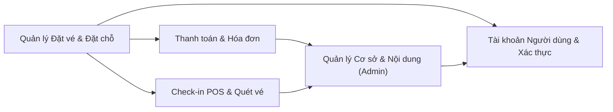

# Tổng quan Feature — tokiwagi

Ứng dụng Next.js full-stack quản lý đặt phòng/vé cho các cơ sở (tenant), tích hợp thanh toán GMO, tích hợp POS Smaregi, và bảng điều khiển admin để quản lý tenant, vé, nhân viên, tin tức và cài đặt hệ thống.

**Framework:** Next.js, React, Express, Prisma, NextAuth, Redux, MUI, TailwindCSS · **Ngôn ngữ:** typescript, javascript, sql, css

Trích xuất từ knowledge graph (understand-anything) lúc `2026-07-01T03:59:51.000Z`, commit `1f6bfea5ae09`.

**5 domain nghiệp vụ · 20 tính năng · 109 bước**

## Sơ đồ tổng quan

## Domain

| Domain | Độ phức tạp | Số tính năng | Số bước |
|---|---|---|---|
| [Quản lý Đặt vé & Đặt chỗ](booking-reservation-management.md) | `phức tạp` | 5 | 31 |
| [Tài khoản Người dùng & Xác thực](user-account-authentication.md) | `trung bình` | 3 | 19 |
| [Quản lý Cơ sở & Nội dung (Admin)](admin-facility-management.md) | `phức tạp` | 5 | 24 |
| [Thanh toán & Hóa đơn](payment-billing.md) | `phức tạp` | 4 | 21 |
| [Check-in POS & Quét vé](pos-checkin-ticketing.md) | `trung bình` | 3 | 14 |

### [Quản lý Đặt vé & Đặt chỗ](booking-reservation-management.md)

Xử lý toàn bộ vòng đời đặt chỗ tại cơ sở: tạo đặt vé online và offline, mua vé tháng/vé theo lượt, quản lý lịch sử đặt vé, hủy vé, và theo dõi hàng chờ/chỗ trống. Đây là domain nghiệp vụ cốt lõi của ứng dụng, xoay quanh tenant, vé và người dùng.

Tính năng:
- Tạo đặt vé trực tuyến (8 bước)
- Tạo đặt vé Offline/Admin (7 bước)
- Quản lý Lịch sử Đặt vé (5 bước)
- Hàng chờ Đặt vé & Theo dõi Chỗ trống (6 bước)
- Mua Vé Tháng/Vé Theo lượt (5 bước)

### [Tài khoản Người dùng & Xác thực](user-account-authentication.md)

Quản lý danh tính người dùng cuối: đăng ký kèm xác thực email, đăng nhập/đăng xuất qua NextAuth, khôi phục mật khẩu và mở khóa tài khoản, và tự quản lý thông tin cá nhân, thẻ tín dụng, tenant yêu thích.

Tính năng:
- Đăng ký & Xác thực Email (6 bước)
- Đăng nhập & Khôi phục Mật khẩu (6 bước)
- Quản lý Thông tin Cá nhân & Tùy chọn (7 bước)

### [Quản lý Cơ sở & Nội dung (Admin)](admin-facility-management.md)

Quản trị back-office cho đơn vị vận hành cơ sở: quản lý tenant (cơ sở), vé/gói vé, tài khoản nhân viên, thông báo tin tức, điều khoản miễn trừ, và cài đặt app/email qua bảng điều khiển admin.

Tính năng:
- Quản lý Tenant (Cơ sở) (5 bước)
- Quản lý Vé (Gói vé) (5 bước)
- Quản lý Tài khoản Nhân viên (4 bước)
- Quản lý Tin tức & Điều khoản Miễn trừ (5 bước)
- Quản lý Cài đặt App & Email (5 bước)

### [Thanh toán & Hóa đơn](payment-billing.md)

Xử lý thanh toán online qua cổng thanh toán GMO, quản lý thẻ tín dụng đã lưu, xử lý thanh toán một phần (partial checkout) cho lưu trú kéo dài, và tạo báo cáo doanh thu, xuất kế toán OBIC.

Tính năng:
- Thanh toán Online qua GMO (6 bước)
- Quản lý Thẻ Tín dụng (5 bước)
- Thanh toán Một phần (Partial Checkout) (4 bước)
- Xuất Doanh thu & Kế toán OBIC (6 bước)

### [Check-in POS & Quét vé](pos-checkin-ticketing.md)

Xử lý vận hành tại cơ sở: quét mã vạch đặt vé để check-in/check-out khách, theo dõi trạng thái đặt vé/chỗ trống theo thời gian thực, và tích hợp với hệ thống POS Smaregi cho thanh toán và đồng bộ tồn kho.

Tính năng:
- Check-in / Check-out bằng Mã vạch (5 bước)
- Tích hợp POS Smaregi (5 bước)
- Quản lý Quét vé & Trạng thái Chỗ trống (4 bước)

## Quan hệ liên Domain

| Từ | Đến | Mô tả |
|---|---|---|
| [Quản lý Đặt vé & Đặt chỗ](booking-reservation-management.md) | [Tài khoản Người dùng & Xác thực](user-account-authentication.md) | Các luồng đặt vé yêu cầu phiên đăng nhập đã xác thực và phụ thuộc vào dữ liệu tài khoản người dùng. |
| [Quản lý Đặt vé & Đặt chỗ](booking-reservation-management.md) | [Thanh toán & Hóa đơn](payment-billing.md) | Đặt vé online và offline kích hoạt xác thực thanh toán GMO và tính phí thẻ tín dụng. |
| [Quản lý Đặt vé & Đặt chỗ](booking-reservation-management.md) | [Check-in POS & Quét vé](pos-checkin-ticketing.md) | Đặt vé đã xác nhận sau đó được check-in/out và quét tại chỗ qua POS/Smaregi. |
| [Thanh toán & Hóa đơn](payment-billing.md) | [Quản lý Cơ sở & Nội dung (Admin)](admin-facility-management.md) | Cài đặt GMO và báo cáo doanh thu/OBIC được admin cấu hình và xem xét. |
| [Check-in POS & Quét vé](pos-checkin-ticketing.md) | [Quản lý Cơ sở & Nội dung (Admin)](admin-facility-management.md) | Cấu hình vé và tenant do admin quản lý điều khiển việc quét POS và kiểm tra chỗ trống. |
| [Quản lý Cơ sở & Nội dung (Admin)](admin-facility-management.md) | [Tài khoản Người dùng & Xác thực](user-account-authentication.md) | Admin quản lý tài khoản nhân viên và người dùng qua hệ thống xác thực dùng chung. |

