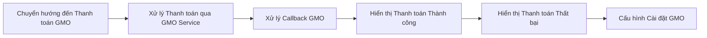
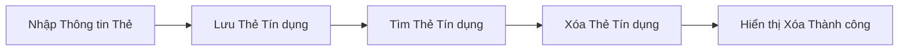
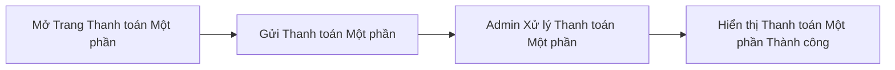
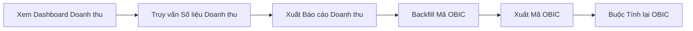

# Thanh toán & Hóa đơn

Xử lý thanh toán online qua cổng thanh toán GMO, quản lý thẻ tín dụng đã lưu, xử lý thanh toán một phần (partial checkout) cho lưu trú kéo dài, và tạo báo cáo doanh thu, xuất kế toán OBIC.

**Độ phức tạp:** `phức tạp` · **Tags:** `payment`, `billing`, `gmo`, `finance`

## Entities chính

- `GmoSetting`
- `CreditCard`
- `Booking`
- `PartialCheckout`

## Business Rules

- Đặt vé online không thể được xác nhận cho đến khi xác thực thanh toán GMO thành công
- Mỗi tenant có cài đặt merchant GMO riêng
- Thanh toán một phần yêu cầu phải có đặt vé đang hoạt động
- Mã kế toán OBIC phải được gắn vào đặt vé/vé để xuất báo cáo doanh thu

## Tương tác với domain khác

- Sử dụng dữ liệu đặt vé từ domain Quản lý Đặt vé & Đặt chỗ
- Cài đặt GMO/doanh thu được cấu hình bởi domain Quản lý Cơ sở & Nội dung (Admin)

## Tính năng (4)

### Thanh toán Online qua GMO

Người dùng được chuyển hướng đến trang thanh toán GMO trong quá trình đặt vé online; GMO xử lý giao dịch và gọi callback về hệ thống với kết quả.

**Bắt đầu từ:** 🌐 HTTP · **Độ phức tạp:** `phức tạp`

**Các bước:**

1. **Chuyển hướng đến Thanh toán GMO** — Người dùng được chuyển hướng đến trang thanh toán online để hoàn tất giao dịch GMO.
2. **Xử lý Thanh toán qua GMO Service** — GMO service xử lý logic xác thực và ghi nhận thanh toán.
3. **Xử lý Callback GMO** — Hệ thống xử lý callback kết quả thanh toán GMO bất đồng bộ.
4. **Hiển thị Thanh toán Thành công** — Hệ thống hiển thị trang xác nhận thanh toán online thành công.
5. **Hiển thị Thanh toán Thất bại** — Hệ thống hiển thị trang thanh toán thất bại kèm hướng dẫn thử lại.
6. **Cấu hình Cài đặt GMO** — Admin cấu hình cài đặt merchant GMO theo từng tenant dùng khi thanh toán.

Chi tiết kỹ thuật — file liên quan trong code (dành cho Dev/Techlead)

Endpoint/trigger: `GET /booking/payment-online`

| # | Bước | File |
|---|---|---|
| 1 | Chuyển hướng đến Thanh toán GMO | `src/pages/booking/payment-online.tsx` |
| 2 | Xử lý Thanh toán qua GMO Service | `src/services/gmo.service.ts` |
| 3 | Xử lý Callback GMO | `src/pages/api/gmo/callback.ts` |
| 4 | Hiển thị Thanh toán Thành công | `src/pages/booking/payment-online-success.tsx` |
| 5 | Hiển thị Thanh toán Thất bại | `src/pages/booking/payment-online-failure.tsx` |
| 6 | Cấu hình Cài đặt GMO | `src/pages/api/admin/gmo-settings/index.ts` |

### Quản lý Thẻ Tín dụng

Người dùng lưu, tìm kiếm và xóa thẻ tín dụng dùng cho thanh toán online và vé định kỳ.

**Bắt đầu từ:** 🌐 HTTP · **Độ phức tạp:** `trung bình`

**Các bước:**

1. **Nhập Thông tin Thẻ** — Người dùng nhập thông tin thẻ tín dụng trong form đặt vé hoặc hồ sơ.
2. **Lưu Thẻ Tín dụng** — Hệ thống lưu thẻ tín dụng qua API tokenize thẻ của GMO.
3. **Tìm Thẻ Tín dụng** — Hệ thống lấy thẻ tín dụng đã lưu của người dùng để dùng lại.
4. **Xóa Thẻ Tín dụng** — Người dùng xóa thẻ tín dụng đã lưu.
5. **Hiển thị Xóa Thành công** — Hệ thống xác nhận xóa thẻ tín dụng thành công.

Chi tiết kỹ thuật — file liên quan trong code (dành cho Dev/Techlead)

Endpoint/trigger: `POST /api/user/credit-card/save`

| # | Bước | File |
|---|---|---|
| 1 | Nhập Thông tin Thẻ | `src/components/CreateBooking/CreditCardForm/index.tsx` |
| 2 | Lưu Thẻ Tín dụng | `src/pages/api/user/credit-card/save.ts` |
| 3 | Tìm Thẻ Tín dụng | `src/pages/api/user/credit-card/search.ts` |
| 4 | Xóa Thẻ Tín dụng | `src/pages/api/user/credit-card/delete.ts` |
| 5 | Hiển thị Xóa Thành công | `src/pages/user/my-page/personal-info/change-credit-card/delete.tsx` |

### Thanh toán Một phần (Partial Checkout)

Người dùng hoặc admin xử lý khoản thanh toán bổ sung một phần trên đặt vé hiện có, ví dụ phí lưu trú kéo dài.

**Bắt đầu từ:** 🌐 HTTP · **Độ phức tạp:** `trung bình`

**Các bước:**

1. **Mở Trang Thanh toán Một phần** — Người dùng mở trang thanh toán một phần cho đặt vé hiện có.
2. **Gửi Thanh toán Một phần** — Khoản thanh toán một phần được gửi qua API bookings partial-checkout.
3. **Admin Xử lý Thanh toán Một phần** — Admin xử lý hoặc xem xét thanh toán một phần thay cho khách hàng.
4. **Hiển thị Thanh toán Một phần Thành công** — Hệ thống xác nhận thanh toán một phần thành công.

Chi tiết kỹ thuật — file liên quan trong code (dành cho Dev/Techlead)

Endpoint/trigger: `GET /user/my-page/booking-history/partial-checkout/[id]`

| # | Bước | File |
|---|---|---|
| 1 | Mở Trang Thanh toán Một phần | `src/pages/user/my-page/booking-history/partial-checkout/[id].tsx` |
| 2 | Gửi Thanh toán Một phần | `src/pages/api/user/bookings/partial-checkout/[id].ts` |
| 3 | Admin Xử lý Thanh toán Một phần | `src/pages/admin/booking-management/partial-checkout/[id].tsx` |
| 4 | Hiển thị Thanh toán Một phần Thành công | `src/pages/user/my-page/booking-history/partial-checkout/success.tsx` |

### Xuất Doanh thu & Kế toán OBIC

Admin xem phân tích doanh thu và xuất mã/báo cáo kế toán OBIC cho đặt vé và vé phục vụ đối soát tài chính.

**Bắt đầu từ:** 🌐 HTTP · **Độ phức tạp:** `trung bình`

**Các bước:**

1. **Xem Dashboard Doanh thu** — Admin xem dashboard quản lý doanh thu.
2. **Truy vấn Số liệu Doanh thu** — Hệ thống truy vấn số liệu doanh thu tổng hợp cho khoảng thời gian đã chọn.
3. **Xuất Báo cáo Doanh thu** — Admin xuất báo cáo doanh thu chi tiết.
4. **Backfill Mã OBIC** — Hệ thống backfill (bổ sung ngược) mã kế toán OBIC còn thiếu cho vé hiện có.
5. **Xuất Mã OBIC** — Admin xuất mã kế toán OBIC cho vé.
6. **Buộc Tính lại OBIC** — Admin buộc tính lại mã OBIC cho một đặt vé cụ thể.

Chi tiết kỹ thuật — file liên quan trong code (dành cho Dev/Techlead)

Endpoint/trigger: `GET /admin/revenue-management`

| # | Bước | File |
|---|---|---|
| 1 | Xem Dashboard Doanh thu | `src/pages/admin/revenue-management.tsx` |
| 2 | Truy vấn Số liệu Doanh thu | `src/pages/api/admin/revenue-management/count.ts` |
| 3 | Xuất Báo cáo Doanh thu | `src/pages/api/admin/revenue-management/export.ts` |
| 4 | Backfill Mã OBIC | `src/pages/api/admin/tickets/[id]/backfill-obic-codes.ts` |
| 5 | Xuất Mã OBIC | `src/pages/api/admin/tickets/obic-codes/export.ts` |
| 6 | Buộc Tính lại OBIC | `src/pages/api/admin/bookings/[id]/force-recompute-obic.ts` |

