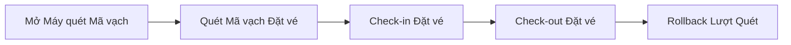
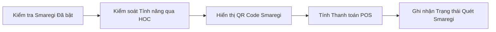
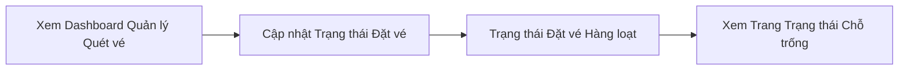

# Check-in POS & Quét vé

Xử lý vận hành tại cơ sở: quét mã vạch đặt vé để check-in/check-out khách, theo dõi trạng thái đặt vé/chỗ trống theo thời gian thực, và tích hợp với hệ thống POS Smaregi cho thanh toán và đồng bộ tồn kho.

**Độ phức tạp:** `trung bình` · **Tags:** `pos`, `smaregi`, `check-in`, `barcode`

## Entities chính

- `Booking`
- `Ticket`
- `Tenant`

## Business Rules

- Một đặt vé chỉ có thể check-in khi đã được xác nhận và chưa check-in trước đó
- Tích hợp Smaregi là tùy chọn theo từng tenant và được kiểm soát bởi feature flag
- Hành động quét có thể được rollback nếu thực hiện nhầm

## Tương tác với domain khác

- Thao tác trên đặt vé được tạo bởi domain Quản lý Đặt vé & Đặt chỗ
- Sử dụng cấu hình vé/tenant từ domain Quản lý Cơ sở & Nội dung (Admin)
- Tính toán và xác nhận số tiền thanh toán POS liên kết với domain Thanh toán & Hóa đơn

## Tính năng (3)

### Check-in / Check-out bằng Mã vạch

Nhân viên cơ sở quét mã vạch đặt vé của khách để check-in hoặc check-out, có khả năng rollback nếu quét nhầm.

**Bắt đầu từ:** 🌐 HTTP · **Độ phức tạp:** `trung bình`

**Các bước:**

1. **Mở Máy quét Mã vạch** — Nhân viên mở giao diện quét mã vạch tại lối vào cơ sở.
2. **Quét Mã vạch Đặt vé** — Nhân viên quét mã vạch đặt vé của khách để tra cứu thông tin đặt chỗ.
3. **Check-in Đặt vé** — Đặt vé được đánh dấu đã check-in tại máy POS.
4. **Check-out Đặt vé** — Đặt vé được đánh dấu đã check-out tại máy POS.
5. **Rollback Lượt Quét** — Nhân viên rollback lượt quét check-in/out bị nhầm.

Chi tiết kỹ thuật — file liên quan trong code (dành cho Dev/Techlead)

Endpoint/trigger: `GET /admin/barcode-scanner`

| # | Bước | File |
|---|---|---|
| 1 | Mở Máy quét Mã vạch | `src/pages/admin/barcode-scanner.tsx` |
| 2 | Quét Mã vạch Đặt vé | `src/pages/api/admin/bookings/scan.ts` |
| 3 | Check-in Đặt vé | `src/pages/api/pos/bookings/check-in.ts` |
| 4 | Check-out Đặt vé | `src/pages/api/pos/bookings/check-out.ts` |
| 5 | Rollback Lượt Quét | `src/pages/api/admin/bookings/rollback-scan.ts` |

### Tích hợp POS Smaregi

Hệ thống kiểm tra tenant có bật tích hợp POS Smaregi hay không, kiểm soát UI liên quan, hiển thị mã QR Smaregi trên vé, và tính số tiền thanh toán POS.

**Bắt đầu từ:** ⚡ Event · **Độ phức tạp:** `trung bình`

**Các bước:**

1. **Kiểm tra Smaregi Đã bật** — Hệ thống kiểm tra tích hợp POS Smaregi có được bật cho tenant hiện tại không.
2. **Kiểm soát Tính năng qua HOC** — Các component UI được kiểm soát bởi higher-order component yêu cầu Smaregi phải được bật.
3. **Hiển thị QR Code Smaregi** — Hệ thống hiển thị mã QR Smaregi trên vé để quét tại POS.
4. **Tính Thanh toán POS** — Hệ thống tính số tiền cần thanh toán tại máy POS Smaregi.
5. **Ghi nhận Trạng thái Quét Smaregi** — Bản ghi đặt vé được cập nhật với trạng thái quét Smaregi.

Chi tiết kỹ thuật — file liên quan trong code (dành cho Dev/Techlead)

Endpoint/trigger: `Tenant-gated feature (SmaregiEnabledContext)`

| # | Bước | File |
|---|---|---|
| 1 | Kiểm tra Smaregi Đã bật | `src/libs/hooks/useSmaregiEnabled.ts` |
| 2 | Kiểm soát Tính năng qua HOC | `src/libs/hoc/withEnabledSmaregi.tsx` |
| 3 | Hiển thị QR Code Smaregi | `src/components/Ticket/ViewTicket/components/SmaregiQRCode.tsx` |
| 4 | Tính Thanh toán POS | `src/pages/api/pos/bookings/calculate-pay-amount.ts` |
| 5 | Ghi nhận Trạng thái Quét Smaregi | `src/utils/server/booking-queue.ts` |

### Quản lý Quét vé & Trạng thái Chỗ trống

Admin theo dõi hoạt động quét theo thời gian thực và trạng thái chỗ trống của cơ sở qua các đặt vé từ dashboard quản lý quét vé.

**Bắt đầu từ:** 🌐 HTTP · **Độ phức tạp:** `đơn giản`

**Các bước:**

1. **Xem Dashboard Quản lý Quét vé** — Admin xem dashboard quản lý quét vé cho hoạt động check-in theo thời gian thực.
2. **Cập nhật Trạng thái Đặt vé** — Admin cập nhật thủ công trạng thái check-in/out của đặt vé khi cần.
3. **Trạng thái Đặt vé Hàng loạt** — Hệ thống lấy thông tin trạng thái đặt vé hàng loạt cho dashboard.
4. **Xem Trang Trạng thái Chỗ trống** — Admin xem trang trạng thái chỗ trống của cơ sở.

Chi tiết kỹ thuật — file liên quan trong code (dành cho Dev/Techlead)

Endpoint/trigger: `GET /admin/scan-management`

| # | Bước | File |
|---|---|---|
| 1 | Xem Dashboard Quản lý Quét vé | `src/pages/admin/scan-management/index.tsx` |
| 2 | Cập nhật Trạng thái Đặt vé | `src/pages/api/admin/bookings/[id]/status.ts` |
| 3 | Trạng thái Đặt vé Hàng loạt | `src/pages/api/admin/bookings/status.ts` |
| 4 | Xem Trang Trạng thái Chỗ trống | `src/pages/admin/vacancies-status/index.tsx` |

