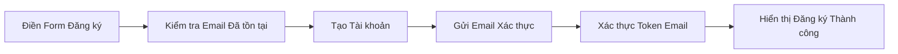
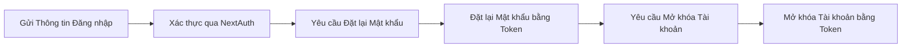
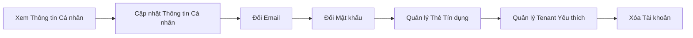

# Tài khoản Người dùng & Xác thực

Quản lý danh tính người dùng cuối: đăng ký kèm xác thực email, đăng nhập/đăng xuất qua NextAuth, khôi phục mật khẩu và mở khóa tài khoản, và tự quản lý thông tin cá nhân, thẻ tín dụng, tenant yêu thích.

**Độ phức tạp:** `trung bình` · **Tags:** `authentication`, `user`, `account`, `security`

## Entities chính

- `User`
- `SecurityQuestion`
- `CreditCard`
- `UserTenantFavorite`

## Business Rules

- Email phải được xác thực trước khi tài khoản hoạt động đầy đủ
- Đăng nhập sai nhiều lần liên tiếp có thể khóa tài khoản, yêu cầu gửi request/token mở khóa
- Đặt lại mật khẩu và đổi email yêu cầu token hợp lệ có giới hạn thời gian

## Tương tác với domain khác

- Cung cấp danh tính đã xác thực cho domain Quản lý Đặt vé & Đặt chỗ
- Tài khoản admin được cấp phát/quản lý bởi domain Quản lý Cơ sở & Nội dung (Admin)

## Tính năng (3)

### Đăng ký & Xác thực Email

Người dùng mới đăng ký tài khoản, hệ thống kiểm tra email trùng lặp, tạo tài khoản, và gửi email xác thực mà người dùng phải xác nhận.

**Bắt đầu từ:** 🌐 HTTP · **Độ phức tạp:** `trung bình`

**Các bước:**

1. **Điền Form Đăng ký** — Người dùng điền form đăng ký với thông tin cá nhân và tài khoản.
2. **Kiểm tra Email Đã tồn tại** — Hệ thống kiểm tra email nhập vào đã được đăng ký hay chưa.
3. **Tạo Tài khoản** — Tài khoản người dùng mới được tạo qua API signup.
4. **Gửi Email Xác thực** — Hệ thống gửi link xác thực email cho người dùng mới.
5. **Xác thực Token Email** — Người dùng xác nhận email bằng cách truy cập link token xác thực.
6. **Hiển thị Đăng ký Thành công** — Hệ thống hiển thị trang xác nhận đăng ký thành công.

Chi tiết kỹ thuật — file liên quan trong code (dành cho Dev/Techlead)

Endpoint/trigger: `POST /api/auth/signup`

| # | Bước | File |
|---|---|---|
| 1 | Điền Form Đăng ký | `src/pages/signup.tsx` |
| 2 | Kiểm tra Email Đã tồn tại | `src/pages/api/user/check-existing-email.ts` |
| 3 | Tạo Tài khoản | `src/pages/api/auth/signup.ts` |
| 4 | Gửi Email Xác thực | `src/services/email.service.ts` |
| 5 | Xác thực Token Email | `src/pages/api/auth/verify/[token].ts` |
| 6 | Hiển thị Đăng ký Thành công | `src/pages/signup-success.tsx` |

### Đăng nhập & Khôi phục Mật khẩu

Người dùng đăng nhập qua NextAuth credentials, hoặc khôi phục truy cập qua các luồng quên mật khẩu, đặt lại mật khẩu, và mở khóa tài khoản khi bị khóa.

**Bắt đầu từ:** 🌐 HTTP · **Độ phức tạp:** `trung bình`

**Các bước:**

1. **Gửi Thông tin Đăng nhập** — Người dùng gửi email/mật khẩu trên trang đăng nhập.
2. **Xác thực qua NextAuth** — NextAuth xác minh thông tin đăng nhập và thiết lập phiên làm việc.
3. **Yêu cầu Đặt lại Mật khẩu** — Người dùng yêu cầu link đặt lại mật khẩu qua chức năng quên mật khẩu.
4. **Đặt lại Mật khẩu bằng Token** — Người dùng đặt mật khẩu mới bằng token đặt lại được gửi qua email.
5. **Yêu cầu Mở khóa Tài khoản** — Người dùng bị khóa tài khoản yêu cầu email mở khóa sau nhiều lần đăng nhập thất bại.
6. **Mở khóa Tài khoản bằng Token** — Người dùng mở khóa tài khoản bằng cách xác nhận link token mở khóa.

Chi tiết kỹ thuật — file liên quan trong code (dành cho Dev/Techlead)

Endpoint/trigger: `POST /api/auth/[...nextauth]`

| # | Bước | File |
|---|---|---|
| 1 | Gửi Thông tin Đăng nhập | `src/pages/signin.tsx` |
| 2 | Xác thực qua NextAuth | `src/pages/api/auth/[...nextauth].ts` |
| 3 | Yêu cầu Đặt lại Mật khẩu | `src/pages/api/auth/forgot-password.ts` |
| 4 | Đặt lại Mật khẩu bằng Token | `src/pages/api/auth/reset-password.ts` |
| 5 | Yêu cầu Mở khóa Tài khoản | `src/pages/api/auth/request-unlock-account.ts` |
| 6 | Mở khóa Tài khoản bằng Token | `src/pages/api/auth/unlock-account.ts` |

### Quản lý Thông tin Cá nhân & Tùy chọn

Người dùng đã xác thực quản lý hồ sơ của mình: thông tin cá nhân, đổi email/mật khẩu, thẻ tín dụng đã lưu, tenant yêu thích, và xóa tài khoản.

**Bắt đầu từ:** 🌐 HTTP · **Độ phức tạp:** `trung bình`

**Các bước:**

1. **Xem Thông tin Cá nhân** — Người dùng xem trang thông tin cá nhân.
2. **Cập nhật Thông tin Cá nhân** — Người dùng cập nhật thông tin hồ sơ cá nhân.
3. **Đổi Email** — Người dùng đổi email tài khoản, kích hoạt bước xác thực lại.
4. **Đổi Mật khẩu** — Người dùng đổi mật khẩu tài khoản từ cài đặt thông tin cá nhân.
5. **Quản lý Thẻ Tín dụng** — Người dùng xem và quản lý thẻ tín dụng đã lưu.
6. **Quản lý Tenant Yêu thích** — Người dùng xem và quản lý danh sách cơ sở (tenant) yêu thích.
7. **Xóa Tài khoản** — Người dùng xóa tài khoản sau khi xác nhận hộp thoại cảnh báo.

Chi tiết kỹ thuật — file liên quan trong code (dành cho Dev/Techlead)

Endpoint/trigger: `GET /user/my-page/personal-info`

| # | Bước | File |
|---|---|---|
| 1 | Xem Thông tin Cá nhân | `src/pages/user/my-page/personal-info/index.tsx` |
| 2 | Cập nhật Thông tin Cá nhân | `src/pages/user/my-page/personal-info/update-information/index.tsx` |
| 3 | Đổi Email | `src/pages/api/user/edit-email/index.ts` |
| 4 | Đổi Mật khẩu | `src/pages/user/my-page/personal-info/change-password.tsx` |
| 5 | Quản lý Thẻ Tín dụng | `src/pages/user/my-page/personal-info/change-credit-card/index.tsx` |
| 6 | Quản lý Tenant Yêu thích | `src/pages/user/my-page/favorite-tenants.tsx` |
| 7 | Xóa Tài khoản | `src/pages/user/my-page/delete-account.tsx` |

